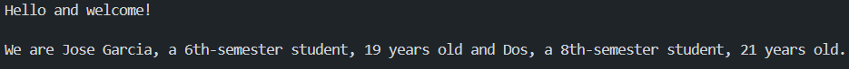

## Team Members

| Names | Institucional Email | GitHub User |
| --- | --- | --- |
| JOSE DANIEL GARCIA PINEDA | jose.gpineda@mail.escuelaing.edu.co |KenjiMaster |
| THOMAS SEBASTIAN GARCIA GOMEZ | thomas.garcia-g@mail.escuelaing.edu.co | thomassebastiangarciagomez-ctrl |

## Challenge Evidence

## Challenge 1 — Welcome Message

### Evidence

### Description

Briefly explain:

- What was implemented.
We implemented three classes: Student, Welcome Message, and Challenge1 as the interface to print the message. Student is responsible for holding the student's information, and Welcome Message is responsible for iterating through the container using Stream and printing the message.

- How the work was divided.
- Which Git operations were used.
- Which conflicts appeared.
- How the conflicts were resolved.

## Technical Explanations

## Answer to the Conceptual Questionnaire

