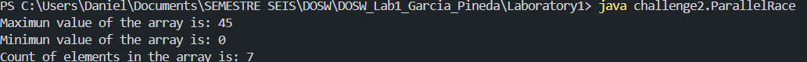
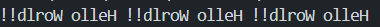

## Team Members

| Names | Institucional Email | GitHub User |
| --- | --- | --- |
| JOSE DANIEL GARCIA PINEDA | jose.gpineda@mail.escuelaing.edu.co |KenjiMaster |
| THOMAS SEBASTIAN GARCIA GOMEZ | thomas.garcia-g@mail.escuelaing.edu.co | thomassebastiangarciagomez-ctrl |

## Challenge Evidence

## Challenge 1 — Welcome Message

### Evidence

### Description

Briefly explain:

- What was implemented.
We implemented three classes: Student, Welcome Message, and Challenge1 as the interface to print the message. Student is responsible for holding the student's information, and Welcome Message is responsible for iterating through the container using Stream and printing the message.

- How the work was divided.
We divided the code into two parts; the first part was to display the name, semester, and age, and the last part was to display the email.

- Which Git operations were used.
We use branch creation, branch switching, commit creation, and pushing/pulling changes.

- Which conflicts appeared.
We had no conflicts because one part is done first and then the other, and they did not affect each other.

## Challenge 2 — Parallel Commit Race

### Evidence

### Description

Briefly explain:

- What was implemented.
For the first collision, we implemented three methods for finding the maximum, minimum, and number of elements. For the second collision, we used methods for finding even and odd numbers.

- How the work was divided.
We divided ourselves according to the instructions, then one followed what corresponded to his line of development.

- Which Git operations were used.
We use branch creation, branch changes, branch status, logs, branch merging, and push/pull

- Which conflicts appeared.
This was one of the challenges that caused the most conflicts, since that was the idea, and we encountered conflicts due to having changed lines in the same file and creating methods with the same names.

- How the conflicts were resolved.
To resolve these issues, we used GitHub's merge editors, which allowed us to choose which changes to keep.

## Challenge 3 — The Mysterious Echo

### Evidence

### Description

Briefly explain:

- What was implemented.
What we did was implement two methods, one to repeat a message and another to reverse it, using String Builder and String Buffer, and finally we combined both methods to obtain the final result.

- How the work was divided.
According to the instructions, we split up, one creating a method and the other using the corresponding class.

- Which Git operations were used.
We use branch creation, branch changes, branch status, logs, branch merging, and push/pull

- Which conflicts appeared.
We only had one in the end when combining both methods

- How the conflicts were resolved.
To resolve these issues, we used GitHub's merge editors, which allowed us to choose which changes to keep.

## Answer to the Conceptual Questionnaire

1. Team agreements: Add the agreements you defined in the Onboarding section here.

2. What is the difference between git merge and git rebase?
git merge combines two branches by creating a new "merge commit" that has two parents, preserving the full history of both branches exactly as it happened. git rebase instead takes the commits from one branch and replays them on top of another branch, creating a linear history as if those changes had been made sequentially from the start.

3. What happens when two branches modify the same line of a file?
Git cannot automatically determine which change should take priority, so it produces a merge conflict. Git marks the file with conflict markers (<<<<<<<, =======, >>>>>>>) showing both versions, and the developer must manually decide how to resolve it before completing the merge.

4. How can you display the branch and merge history graphically in the terminal?
In terminal, you need to script this line "git log --graph --oneline --all", you can put a tag if you do not want script this always you need

5. What is the difference between a commit and a push?
A commit saves a snapshot of your changes to your local repository history. A push sends those local commits to a remote repository, making them visible to your team.

6. What are git stash and git stash pop used for?
git stash temporarily saves your uncommitted changes (both staged and unstaged) and reverts your working directory to a clean state, without creating a commit. git stash pop restores the most recently stashed changes and removes them from the stash list.

7. What is the difference between HashMap and Hashtable?
HashMap is not synchronized (not thread-safe) and allows one null key and multiple null values. Hashtable is synchronized (thread-safe) and does not allow null keys or null values at all.

8. What advantages does Collectors.toMap() provide over a traditional loop?
Collectors.toMap() lets you build a Map in a single declarative expression as part of a stream pipeline, without needing a mutable variable declared outside the loop. It also provides built-in handling for duplicate keys through a merge function, and lets you choose the resulting Map implementation directly.

9. When using stream().map() on a list of objects, what type of operation is being performed?
It's a intermediate operation each element in the stream is converted into a new value or object, producing a new stream with the same number of elements but potentially a different type.

10. What does stream().filter() do, and what does it return?
filter() evaluates each element against a boolean condition (a Predicate) and keeps only the elements that return true, discarding the rest. It returns a new Stream with a subset (or all, or none) of the original elements — never more elements than the original, and always the same type.

11. Describe the steps required to create a new feature branch from develop.
Step 1: git checkout develop, We need to be in the develop branch to start the prosses
Step 2: git pull origin develop: We need to download the progress in the develop branch
Step 3: git checkout -b feature/newBranch: We create the new branch in feature

13. What is the difference between git branch and git checkout -b?
git branch <name> only creates a new branch, but keeps you on your current branch. git checkout -b <name> creates the new branch and switches to it immediately, in a single command.

14. Why should new functionality be developed in feature/* branches instead of directly in main?
Developing in feature/* branches keeps main always stable and deployable, since incomplete or experimental work never affects it directly. It also allows multiple team members to work in parallel without interfering with each other's code, and enables code review (via pull requests) before changes are merged into main.
